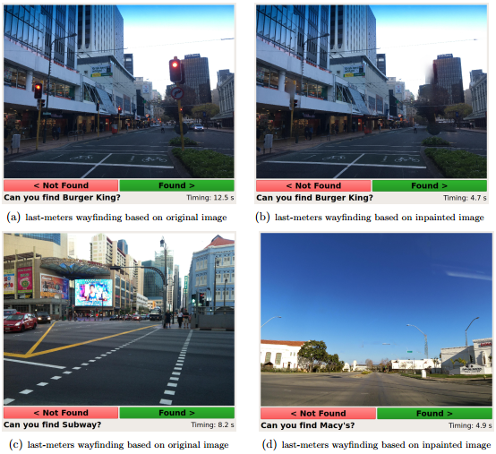

# A Saliency-Guided Street View Image Inpainting Framework for Efficient Last-Meters Wayfinding [<a href="https://arxiv.org/pdf/2205.06934.pdf?ref=https://githubhelp.com">Paper</a>]

### Step3 - Measurement of human visual attention

Evaluation of human visual changes based on UNISAL network (<a href="https://github.com/rdroste/unisal">link</a>) and a self-developed human labelling program. 

Self-developed program for human last-meters wayfinding evaluation. Paired images, for example, examples in (a) and (b), are used to report results for comparison, while unpaired images, e.g., examples in (c) and (d), are shown to each volunteer to ensure that the finding scene is not repeated.



## Citation
For more details please refer to the UNISAL paper:
```
@inproceedings{droste2020unified,
  title={Unified image and video saliency modeling},
  author={Droste, Richard and Jiao, Jianbo and Noble, J Alison},
  booktitle={European Conference on Computer Vision},
  pages={419--435},
  year={2020},
  organization={Springer}
}
```
and our paper:
```
@article{hu2022saliency,
  title={A Saliency-Guided Street View Image Inpainting Framework for Efficient Last-Meters Wayfinding},
  author={Hu, Chuanbo and Jia, Shan and Zhang, Fan and Li, Xin},
  journal={arXiv preprint arXiv:2205.06934},
  year={2022}
}
